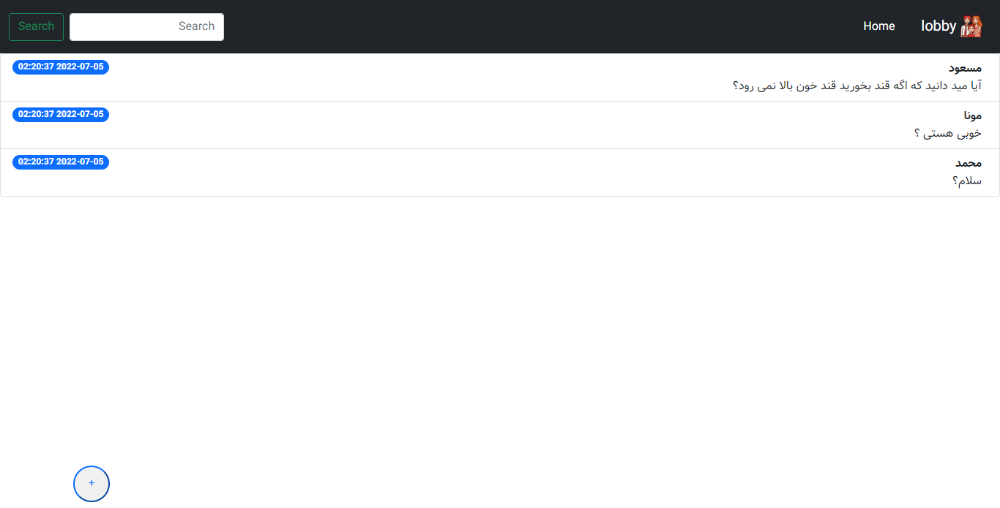

  
  <h2 align="center"> Lobby Project</h2>
     
  

    

## About The Project

front : Html , css  , botostart
Backend : Laravel , php
It has been tried to clean the code
happy we with star and follow in linkedin , enjoy coding :)
